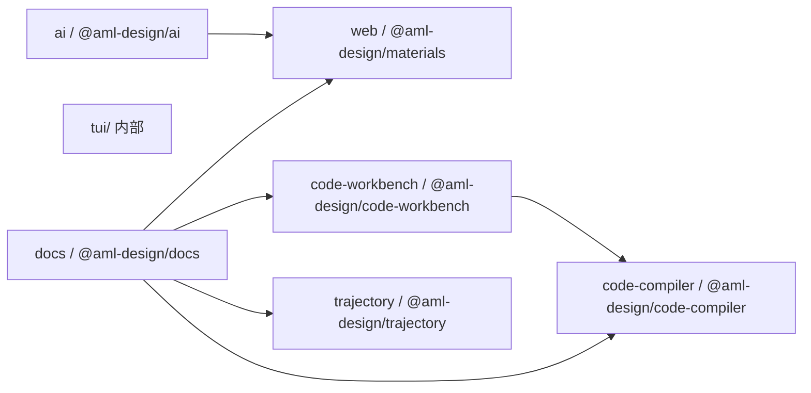

# AML Design 架构总览

> 基于 [AGENTS.md](./AGENTS.md)、[spec.md](./spec.md)、[README.md](./README.md) 及各 workspace 源码梳理的总体架构文档。
>
> AML Design 是一个面向企业级 AI/ML 平台的高层组件与工具生态，覆盖「组件库 → 浏览器编译器 → 代码工作台 → AI 沙箱 → 轨迹库 → 文档站」的完整链路，托管于字节跳动的 EMO monorepo。

## 1. 整体架构

### 1.1 定位与设计哲学

引自 [packages/ai/DESIGN.md](./packages/ai/DESIGN.md)，AML Design 面向 ML 训练 / 推理 / 商业化投放 / 运维（MLOps）等**高信息密度、强交互**场景，秉持三条设计原则：

| 原则                        | 含义                                                                       |
| --------------------------- | -------------------------------------------------------------------------- |
| **安全可信 (Trusted)**      | 强调 UI 透明度：数据溯源、AI 生成来源、持续监控反馈                        |
| **便捷可用 (Convenient)**   | 高韧性：支持撤销/重做、即时反馈、自动保存、明确的退出路径                  |
| **全域智能 (Omnipresent)**  | 上下文感知：AI 融入工作流（自动补全、智能提示、主动辅助），而非孤立的工具 |

### 1.2 顶层目录

```text
aml-design/
├── packages/
│   ├── web/               # @aml-design/materials       — 组件库（对外发布）
│   ├── code-compiler/     # @aml-design/code-compiler   — 浏览器端编译器
│   ├── code-workbench/    # @aml-design/code-workbench  — 可嵌入代码工作台 UI
│   ├── ai/                # @aml-design/ai              — AI 动态 UI 沙箱
│   ├── trajectory/        # @aml-design/trajectory      — Agent 轨迹渲染库
│   ├── tui/               # 内部 Terminal UI 试验场（private）
│   └── docs/              # @aml-design/docs            — Rspress 文档站（private）
├── scripts/               # 发布 / 版本 / BOM 等基建脚本
├── eden.monorepo.json     # EMO 配置
└── package.json           # 根目录基建依赖
```

### 1.3 技术栈

- **包管理与编排**：[EMO](https://emo.web.bytedance.net/)（顶层基建），必须使用 `emo` 而非 `pnpm`
- **构建**：[Rslib](https://rslib.rs/)（库产物）、[Rsbuild](https://rsbuild.rs/) / [Rspack](https://rspack.rs/)（应用）
- **文档站**：[Rspress](https://rspress.rs/)
- **测试**：[Rstest](https://rstest.rs/)
- **代码质量**：[Biome](https://biomejs.dev/)
- **组件基座**：[Arco Design](https://arco.design/) + 内部 IconBox（`@arco-design/iconbox-react-iconbox-react-aml-design`）
- **发布通道**：[Luban](https://luban.bytedance.net/) / BITS 流水线

### 1.4 依赖关系（workspace 内部）



## 2. 各模块详解

### 2.1 `@aml-design/materials`（packages/web） — 通用组件库

面向业务侧发布的通用组件库，是 AML Design 生态的地基。已通过 `emo run release --filter @aml-design/materials` 发布至内网 npm。

**目录结构（组件规范摘自 [spec.md](./spec.md)）：**

```text
packages/web/src/AComponent/
├── index.ts          # 组件与类型导出
├── AComponent.tsx    # 主逻辑
├── interface.ts      # TS 接口
├── doc.tsx           # 文档（Rspress 消费）
├── style/index.less  # 样式（禁止在 JS/TS 中 import）
└── locale/index.ts   # i18n（zh-CN / en-US）
```

**当前公开的组件（[src/index.ts](./packages/web/src/index.ts)）：**

| 组件                      | 作用                                                                 |
| ------------------------- | -------------------------------------------------------------------- |
| `ACard`                   | 通用卡片容器（支持复制标题、footer 承载元数据，是常用布局单元）      |
| `ACodeDiff`               | 基于 CodeMirror merge view 的双列/统一 diff 展示                     |
| `AConfigProvider`         | 全局配置（i18n、主题、注入 Arco ConfigProvider）                     |
| `ACopyButton`             | 一键复制按钮，带 toast 反馈                                          |
| `ADraggableSortList`      | 基于 `@dnd-kit` 的可拖拽排序列表                                     |
| `AEllipsis`               | 多行截断 + Tooltip 展开                                              |
| `AInlineEdit`             | 就地编辑单元格                                                       |
| `ALayout`                 | 桌面端页面布局骨架                                                   |
| `ALog`                    | 日志/流式文本渲染                                                    |
| `AMobileLayout`           | 移动端页面布局骨架                                                   |
| `AMonacoEditor`           | Monaco Editor 的 React 封装（多语言、主题、只读）                    |
| `AScrollLoadList`         | 无限滚动列表（内置节流、loading、空态）                              |
| `ASearch`                 | 通用搜索输入（防抖、快捷键）                                         |
| `ASimpleParamsPanel`      | 参数面板（键值对表单，用于模型/训练参数）                            |
| `AThemeSwitch`            | 亮/暗主题切换开关                                                    |
| `ATosPathModal`           | 内部 TOS 对象存储路径选择弹窗                                        |
| `arco/*`                  | 二次封装的 Arco 组件（保持 API 一致但注入设计规范默认值）            |
| `hooks/*`                 | 通用 hooks（表单/布局/异步）                                         |
| `utils/*`                 | 工具函数（含 `react-19-adapter` 用于跨版本兼容）                     |

**关键约束：**

- 命名以 `A` 前缀 + PascalCase（`ACard` / `ASearch`）。
- CSS 类前缀 `aml-` 或组件名，避免全局污染。
- **CRITICAL：`.less/.css` 禁止在 `.ts/.tsx` 中 import**，由消费者手动引入（此约束在 [AGENTS.md](./AGENTS.md)、[spec.md](./spec.md)、[README.md](./README.md) 中三次强调）。
- 所有文本必须支持 i18n（zh-CN + en-US）。
- 复用 Arco Design 组件，不重复造轮子。

### 2.2 `@aml-design/code-compiler`（packages/code-compiler） — 浏览器端编译器

将一份「虚拟文件映射」在浏览器里编译打包成一段可执行的 ESM 字符串。用于 iframe 预览、在线编辑器、代码沙箱等场景。详见 [packages/code-compiler/README.md](./packages/code-compiler/README.md) 与 [ARCHITECTURE.md](./packages/code-compiler/ARCHITECTURE.md)。

**能力边界：**

- ✅ 支持 `.ts/.tsx/.js/.jsx/.json/.css` 的基础编译与打包
- ✅ production 下将第三方裸包名解析到 CDN（[esm.sh](https://esm.sh)）并 fetch 参与打包
- ✅ 支持 `import 'https://...'` 直接引用 URL 模块
- ✅ 通过 Preset 扩展任意框架/工具链能力
- ❌ 不是包管理器（不 install、不解 lockfile）
- ❌ 不打图片/字体/音视频等静态资源
- ❌ 不提供运行时容器（iframe 由宿主创建）

**核心 API：**

```ts
import compile, { warmup, reactPreset, lessPreset, postcssPreset, sassPreset, tailwindPreset, vuePreset } from '@aml-design/code-compiler';

const { code, meta } = await compile({
  files: { '/App.tsx': 'export default () => <h1>Hi</h1>;' },
  packageJson: { dependencies: { react: '18.3.1' } },
  esbuildWasmUrl: 'https://cdn.example.com/esbuild.wasm',
  production: true,
  presets: [reactPreset({ version: '18.3.1' }), lessPreset()],
});
```

**底层依赖：**

- [esbuild-wasm](https://esbuild.github.io/)：浏览器内 bundle / TS/JSX 转换
- [`@babel/standalone`](https://babeljs.io/docs/babel-standalone)：仅 `reactPreset` 的 inspector 开启时动态加载
- `path-browserify`：路径处理
- CDN：默认 `https://esm.sh`，可通过 `getCdnOrigin` 覆盖

**Preset 协议（[preset/types.ts](./packages/code-compiler/src/preset/types.ts) 定义）：** 声明式地贡献 `esbuildPlugins` / `resolve` / `load` / `transformers` / `style` / `css` / `defaults` / `externals` 等切片，由 `mergePresets` 完成去重、依赖校验、拓扑排序、按责任链短路语义执行。

**内置 Preset：**

| Preset            | 作用                                                              |
| ----------------- | ----------------------------------------------------------------- |
| `reactPreset`     | 锁定 React 版本、注入 `data-debug-id`、去除 CDN 里的副作用 CSS   |
| `vuePreset`       | 锁定 Vue 版本、加载 `@vue/compiler-sfc` 编译 `.vue`               |
| `lessPreset`      | 通过 CDN 加载 `less` 编译 `.less`                                 |
| `sassPreset`      | 通过 CDN 加载 `sass.dart.js` 编译 `.scss`                         |
| `postcssPreset`   | 通用 PostCSS 后处理管线（autoprefixer / nested / preset-env 等）  |
| `tailwindPreset`  | Tailwind 配置解析骨架（`transform` 由调用方提供）                 |

**首次编译体验：** 首次调用 `compile()` 需下载 esbuild-wasm（~9MB）。可用 `warmup()` 在空闲时段预热，且**幂等 / SSR 安全 / 与 compile 共享单例**。

### 2.3 `@aml-design/code-workbench`（packages/code-workbench） — 可嵌入代码工作台 UI

由「**文件树 + CodeMirror 编辑器 + 浏览器内编译预览 + 终端**」组成的可嵌入 IDE 面板。是 [code-compiler](#22-aml-designcode-compilerpackagescode-compiler--浏览器端编译器) 的直接消费者，为其提供完整的可视化壳。详见 [packages/code-workbench/README.md](./packages/code-workbench/README.md)。

**核心能力：**

- **文件树 (`FileTree`)**：虚拟 FS 快照渲染、未保存/加载状态、可插拔图标（`DEFAULT_FILE_ICONS`、`EXTENDED_FILE_ICONS` 等）、slots/renderNode 自定义
- **编辑器 (`CodeMirrorEditor`)**：多语言高亮、滚动/选区状态保存、文档隔离、**流式打字机写入**、保存快捷键
- **预览 (`Preview`)**：调用 `code-compiler` 编译当前 FileMap，通过 `Blob URL + iframe.srcdoc` 沙箱执行；内置错误覆盖层与运行时 postMessage 协议
- **终端 (`Terminal`)**：默认回显模式；可通过 `terminalBackend` 注入真实后端（如 WebSocket 到 PTY）
- **主题 (`ThemeProvider` / `ThemeSwitch`)**：作用域内 `data-theme="dark|light"`，**不污染宿主 `<html>`**

**统一数据模型 FileMap：**

```ts
type FileMap = Record<
  string,
  | { type: 'file'; content?: string; isBinary?: boolean }
  | { type: 'folder' }
  | undefined
>;
```

**状态管理：** 基于 [nanostores](https://github.com/nanostores/nanostores) 的 `workbenchStore`（默认单例）+ `createWorkbenchStore()` + `WorkbenchStoreProvider`（多实例场景），可在 React 之外订阅。

**设计原则：**

- 不写 `localStorage`、不动 `<html>`
- 样式仅通过 `sideEffects` 暴露，由宿主显式引入
- Store 与组件解耦，Provider 优先

### 2.4 `@aml-design/ai`（packages/ai） — AI 动态 UI 沙箱 ★ 重点

> ⭐ **本模块是 AML Design 中 AI 相关能力的核心承载**：把大模型流式生成的 HTML/CSS 片段以受控、安全、自适应的方式呈现在业务应用里。

模块入口 [packages/ai/src/index.tsx](./packages/ai/src/index.tsx) 仅导出 [`DynamicUiSandbox`](./packages/ai/src/DynamicUiSandbox/DynamicUiSandbox.tsx)。

#### 2.4.1 组件定位

`DynamicUiSandbox` 是一个 iframe 沙箱容器，用于**在业务侧安全渲染由 LLM（大模型）生成、以流式方式增量到达的 UI 代码**。它面向的典型消费者是聊天/Agent 类产品（如飞书、豆包、内部 IDE），当模型在流式响应中吐出 HTML 或 widget 时，实时在对话流里预览。

#### 2.4.2 关键特性

| 能力              | 实现要点                                                                                                          |
| ----------------- | ----------------------------------------------------------------------------------------------------------------- |
| **iframe 隔离**   | `sandbox="allow-scripts allow-popups allow-popups-to-escape-sandbox"`，通过 `srcDoc` 注入初始 HTML                |
| **流式预览**      | 未 `isFinal` 时，从流式 payload 中提取可预览片段（`extractPreviewWidgetHtml`）并用 `WIDGET_UPDATE_EVENT` 增量推送 |
| **最终渲染**      | `isFinal=true` 时解析 `payload` 中的 `widget_code`，`WIDGET_FINALIZE_EVENT` 一次性替换                            |
| **自适应高度**    | iframe 内部 50ms 防抖 ResizeObserver 上报，`WIDGET_HEIGHT_EVENT` 同步给外层；宿主可通过 `initialHeight` 缓存高度  |
| **主题联动**      | 外部 `theme: 'light' \| 'dark'` 通过 `WIDGET_THEME_EVENT` postMessage 进入 iframe，映射到 Arco 主题变量           |
| **XSS 防护**      | `sanitizePreviewWidgetHtml` 对流式预览片段做 sanitize                                                             |
| **消息回传**      | widget 内可调用 `window.__widgetSendMessage(text)` → `onSendMessage` 回调                                         |
| **滚动意图**      | widget 检测到用户主动滚动 → `onScrollIntent` 通知宿主暂停自动跟随                                                 |
| **导出**          | Toolbar 支持导出 HTML / PNG（Ref 暴露 `exportHtml/exportImage`）                                                  |
| **全屏**          | 内部 `handleFullscreenToggle` + Esc 退出；进入前用 `getBoundingClientRect` 缓存高度防止宿主虚拟滚动卸载           |
| **Goofy 部署**    | 通过 `toolbar.goofyDeploy` 一键发布到内部 goofy 域，自动 hash `uniqueKey` 生成子域                                |
| **依赖注入**      | 支持 `dependencyStyles` / `dependencyScripts` 追加 CSS/JS 到 iframe head                                          |

#### 2.4.3 消息协议（[widgetIframeReceiver.ts](./packages/ai/src/DynamicUiSandbox/widgetIframeReceiver.ts)）

宿主 ↔ iframe 之间通过 `postMessage` 通信，全部事件常量：

```text
widget:update              # 流式预览片段增量更新
widget:finalize            # 最终稳定版整体替换
widget:height              # iframe 高度上报
widget:send-message        # widget 内文本回传给宿主
widget:theme               # 主题切换
widget:user-scroll-intent  # 用户滚动意图
widget:scroll-into-view    # iframe 请求滚动到视口
widget:export-html         # 触发导出 HTML
widget:export-image        # 触发导出 PNG
widget:goofy-deploy        # 部署到 goofy
```

安全校验：`event.source !== iframeRef.current?.contentWindow` 时直接丢弃。

#### 2.4.4 Mojo Web Components 体系

`@aml-design/ai` 内建了一整套面向 LLM 流式输出的 Web Components，位于 [packages/ai/src/DynamicUiSandbox/web-components/](./packages/ai/src/DynamicUiSandbox/web-components/)。它们通过 `rslib.config.ts` 的预构建脚本被自动扫描并转成模板字符串（[widgetWebComponents.generated.ts](./packages/ai/src/DynamicUiSandbox/widgetWebComponents.generated.ts)），最终注入 iframe。

**组件清单：**

| 标签                    | 作用                                          |
| ----------------------- | --------------------------------------------- |
| `<mojo-accordion>`      | 可折叠面板                                    |
| `<mojo-action-btn>`     | 交互按钮（点击 → `__widgetSendMessage`）      |
| `<mojo-callout>`        | 提示/告警块                                   |
| `<mojo-card>`           | 卡片                                          |
| `<mojo-column>`         | 列容器（用于看板）                            |
| `<mojo-desc-list>`      | 键值对描述列表                                |
| `<mojo-echarts>`        | ECharts 图表容器                              |
| `<mojo-kanban>`         | 看板布局                                      |
| `<mojo-metric>`         | 指标卡（大数字）                              |
| `<mojo-table>`          | 表格（含类名清洗，接收 LLM 生成的任意 HTML） |
| `<mojo-tabs>`           | 标签页（含 `<mojo-tab>` / `<mojo-tab-panel>`）|
| `<mojo-timeline>`       | 时间线                                        |

**架构约束（[README.md](./packages/ai/src/DynamicUiSandbox/web-components/README.md)）：**

1. **Light DOM 而非 Shadow DOM**：因为 Tailwind CDN 是全局注入的，Shadow DOM 会导致继承失败
2. **禁止 `setTimeout` 处理子节点**：LLM HTTP Chunked 流式输出可能被截断分批到达，必须用 **`MutationObserver` 虚拟插槽** 实时搬运节点
3. **防重入锁**：
   - `dataset.rendered`：DOM 结构渲染只执行一次
   - `dataset.eventsBound`：事件绑定单独一次（**支持导出后离线水合**）
   - `data-processed`：子节点处理标记
4. **纯净 JS 源码**：这些 `.js` 文件运行在 iframe，禁止 TS 语法 / 深层三元
5. **动态类名警告**：避免 `text-${color}-6` 这类拼接，Tailwind Play CDN 无法扫描；推荐映射表
6. **类名清洗**：面向 LLM 生成的组件（如 `mojo-table`）必须白名单过滤 Tailwind 类

#### 2.4.5 iframe 依赖脚本

Sandbox 默认注入以下 CDN 依赖：

- `https://sf-unpkg-src.bytedance.net/echarts@5.5.1/dist/echarts.min.js` — 图表
- `https://sf-unpkg-src.bytedance.net/@tailwindcss/browser@4` — Tailwind Play CDN
- `https://sf-unpkg-src.bytedance.net/morphdom@2.7.8/dist/morphdom-umd.js` — DOM diff（用于流式更新时最小化重排）

**Arco Design Token 映射：** [tailwind-arco-colors.ts](./packages/ai/src/DynamicUiSandbox/tailwind-arco-colors.ts) 将 Arco CSS 变量（`--primary-6` / `--color-text-1` 等）暴露给 Tailwind 使用，配合主题切换即可完成暗色模式。

#### 2.4.6 设计规范（[guideline.md](./packages/ai/guideline.md)）

作为 AI 生成 UI 时可加载的 Skill 上下文，明确了：

- **色彩系统**：主色 `#5252FF` 品牌紫、Arco Yuanli 品牌蓝、功能色（success/warning/danger/info）、分类色、7 级风险安全色、方舟灰
- **字体**：`PingFang SC` / `Roboto` / `Byte Sans` / `Roboto Mono`，`display / title / body` 三档九级
- **圆角**：`sm(4) / md(6) / lg(8) / xl(12)`
- **强制约束**：
  - ⛔ 禁止渐变色（除非用户显式给色值）
  - ⛔ 按钮内禁止放图标（icon-only 正方形按钮除外）

### 2.5 `@aml-design/trajectory`（packages/trajectory） — Agent 轨迹库

面向 Agent / 大模型场景的**执行轨迹（trajectory）** 渲染库，用于把 Agent 的调用链、工具执行、中间思考等 timeline 化呈现。

- 当前处于 `0.0.1` 初始阶段，`src/index.ts` 仅有 `version` 导出
- 已在 [`@aml-design/docs`](#27-aml-designdocspackagesdocs--文档站) 声明 `workspace:*` 依赖，准备与 code-workbench 联动展示 Agent 全流程
- 依赖 `@arco-design/web-react` + `classnames`，样式沿用组件库规范（sideEffects + 手动引入）

### 2.6 `@aml-design/tui`（packages/tui） — 内部 Terminal UI 试验场（private）

用于探索 **Terminal UI 组件生态** 的私有 workspace（不发布），聚焦：

- [components/](./packages/tui/src/components) — 组件契约（`contracts.ts`）与目录索引（`catalog.ts`）
- [patterns/](./packages/tui/src/patterns) — 组合 pattern
- [theme/](./packages/tui/src/theme) — TUI 主题体系（`schema.ts` / `themes.ts` / `validation.ts`）

以 Rspress 为壳提供 `dev / build / preview` 命令；主要作为设计与协议试验田，不对外交付。

### 2.7 `@aml-design/docs`（packages/docs） — 文档站

基于 [Rspress](https://rspress.rs/) 的私有文档站，是 AML Design 生态的门面。发布路径由 `npm run release:doc` 触发。

**功能地图：**

- `src/guide/start` — 快速上手
- `src/guide/ai` — **AI 集成三件套**：
  - [cli.mdx](./packages/docs/src/guide/ai/cli.mdx) — `@aml-design/cli` CLI 工具（脚手架、离线元数据查询、MCP、AST 分析 Lint）
  - [skill.mdx](./packages/docs/src/guide/ai/skill.mdx) — AML Design 官方 Skill（托管于 AgentBuddy），让 AI Agent 在生成代码前主动查真实 API
  - [mcp.mdx](./packages/docs/src/guide/ai/mcp.mdx) — AML Design MCP Server（组件文档检索、Design Token 双向查询、Icon 语义/图片搜索）
  - [llms.md](./packages/docs/src/guide/ai/llms.md) — 供 LLM 消费的组件目录
- `src/guide/others` — Agentic Design 等其他能力
- `src/develop/code-compiler` — [code-compiler](#22-aml-designcode-compilerpackagescode-compiler--浏览器端编译器) 使用指南
- `src/develop/code-workbench` — [code-workbench](#23-aml-designcode-workbenchpackagescode-workbench--可嵌入代码工作台-ui) 使用指南（含可交互 Playground）
- `src/components` — 组件预览工具（`CompilePreview.tsx` 直接消费 code-compiler + code-workbench）

## 3. 构建与发布链路

### 3.1 常用命令（EMO）

| 命令                                                          | 作用                            |
| ------------------------------------------------------------- | ------------------------------- |
| `emo install`                                                 | 安装依赖                        |
| `emo run build`                                               | 构建所有 workspace              |
| `emo run dev`                                                 | 所有 workspace watch 构建       |
| `emo test`                                                    | 运行所有测试                    |
| `emo run check`                                               | Biome lint                      |
| `emo run format`                                              | Biome format                    |
| `emo run doc --filter @aml-design/docs`                       | 启动文档站 dev server           |
| `emo run build --filter @aml-design/docs`                     | 构建文档站                      |
| `npm run release:web`                                         | 发布 `@aml-design/materials`    |
| `npm run release:compiler`                                    | 发布 `@aml-design/code-compiler`|
| `npm run release:workbench`                                   | 发布 `@aml-design/code-workbench`|
| `npm run release:doc`                                         | 部署文档站                      |

### 3.2 发布流程要点

- 所有 `release:*` 走 [Luban](https://luban.bytedance.net/) / BITS 流水线（本地不建议 `npm publish`）
- 本地需存在 `luban.config.json`（含 username/password；已在 `.gitignore` 中）
- Beta 版本可通过 `cd packages/web && npm publish --tag beta` 直发

### 3.3 本地调试外部宿主

- **优先方案**：宿主与本仓在同一 EMO monorepo，使用 `workspace:*` 直接引用
- **次选方案**：`npm link` + 在宿主 webpack/rspack `resolve.alias` 中强制 React 单例，规避 `Invalid hook call`

## 4. AI 生态总览（重点）

AML Design 的 AI 能力横跨「运行时」与「研发时」两条主线，构成完整闭环：

```mermaid
flowchart LR
  subgraph Runtime[运行时 - 面向终端用户/业务应用]
    dus[DynamicUiSandbox<br/>@aml-design/ai]
    mojo[Mojo Web Components<br/>mojo-* 系列]
    traj[Trajectory<br/>@aml-design/trajectory]
    dus --> mojo
  end

  subgraph Devtime[研发时 - 面向开发者/AI Agent]
    cli[aml-design CLI<br/>@aml-design/cli]
    skill[aml-design Skill<br/>AgentBuddy 托管]
    mcp[AML Design MCP Server<br/>bytedance.mcp.aml_design]
    guide[设计规范<br/>packages/ai/guideline.md]
    cli --> skill
    cli --> mcp
  end

  llm[LLM 生成 UI 代码<br/>HTML + Tailwind + Mojo Tags]
  llm -->|流式 payload| dus
  guide -.->|规范上下文| llm
  skill -.->|API 元数据| llm
  mcp -.->|Token/Icon 查询| llm
```

### 4.1 运行时侧

| 能力                       | 位置                                                                                                | 作用                                              |
| -------------------------- | --------------------------------------------------------------------------------------------------- | ------------------------------------------------- |
| **DynamicUiSandbox**       | [packages/ai](./packages/ai)                                                                        | LLM 流式 UI 的安全沙箱、全屏、导出、部署          |
| **Mojo Web Components**    | [web-components/](./packages/ai/src/DynamicUiSandbox/web-components/)                               | 面向流式渲染优化的语义化标签体系                  |
| **Trajectory**             | [packages/trajectory](./packages/trajectory)                                                        | Agent 执行轨迹可视化（规划中）                    |
| **Arco Token Bridge**      | [tailwind-arco-colors.ts](./packages/ai/src/DynamicUiSandbox/tailwind-arco-colors.ts)               | 让 LLM 生成的 Tailwind 类无缝复用 Arco 主题变量   |

### 4.2 研发时侧

| 能力                       | 说明                                                                                                     |
| -------------------------- | -------------------------------------------------------------------------------------------------------- |
| **`@aml-design/cli`**      | 离线组件元数据查询 + 项目脚手架 + AST 分析 Lint + MCP 协议原生支持；`npx @aml-design/cli create` 即可用  |
| **AML Design Skill**       | 通过 AgentBuddy 分发；让 AI Agent 编码前先 `aml-design info/demo/doc` 拉真实 API，规避幻觉               |
| **AML Design MCP Server**  | 提供 `get_aml_design_document` / `token_color_lookup` / `search_aml_design_icon` 三大工具                |
| **设计规范 Skill**         | [`packages/ai/guideline.md`](./packages/ai/guideline.md) 作为「火山方舟设计规范」上下文注入 LLM          |
| **代码工作台**             | [code-workbench](#23-aml-designcode-workbenchpackagescode-workbench--可嵌入代码工作台-ui) 提供 Playground/在线运行环境，方便 AI 生成的代码直接可交互验证 |
| **浏览器编译器**           | [code-compiler](#22-aml-designcode-compilerpackagescode-compiler--浏览器端编译器) 提供 AI 生成代码的实时编译预览基础设施 |

### 4.3 AI 生态设计原则

1. **不做孤立的 AI 功能**：AI 融入既有工作流，而非独立入口（引自 [DESIGN.md](./packages/ai/DESIGN.md) 第 3 条）
2. **流式优先**：所有面向 LLM 输出的组件必须兼容 HTTP Chunked、可能被截断的到达节奏
3. **透明可信**：AI 生成物必须暴露数据来源、模型版本、时间戳
4. **可退出**：训练/推理长任务必须可取消、可回滚
5. **规范先行**：色彩 / 字体 / 圆角三大 Token 通过 Skill 与 guideline 直接约束 LLM 输出

## 5. 关键约束回顾

- 📛 **`.less/.css` 禁止在 JS/TS 中 import**（AGENTS/spec/README 三处强调）
- 📛 **必须使用 `emo` 而非 `pnpm`**
- 📛 编辑完文件必须停下来告知用户改动，未主动请求不得 `git commit`
- 📛 组件命名 `A` 前缀 PascalCase，i18n 必备 zh-CN + en-US
- 📛 monorepo 内部依赖用 `workspace:*` 协议
- 📛 LLM UI 组件禁用渐变、按钮禁放图标（除 icon-only 方形按钮）

## 6. 延伸阅读

- 顶层规范：[AGENTS.md](./AGENTS.md)、[spec.md](./spec.md)、[development.md](./development.md)、[checklist.md](./checklist.md)
- 模块级：[packages/code-compiler/ARCHITECTURE.md](./packages/code-compiler/ARCHITECTURE.md)、[packages/code-workbench/README.md](./packages/code-workbench/README.md)、[packages/ai/DESIGN.md](./packages/ai/DESIGN.md)、[packages/ai/guideline.md](./packages/ai/guideline.md)
- Web Components：[packages/ai/src/DynamicUiSandbox/web-components/README.md](./packages/ai/src/DynamicUiSandbox/web-components/README.md)、[SOUL.md](./packages/ai/src/DynamicUiSandbox/web-components/SOUL.md)
